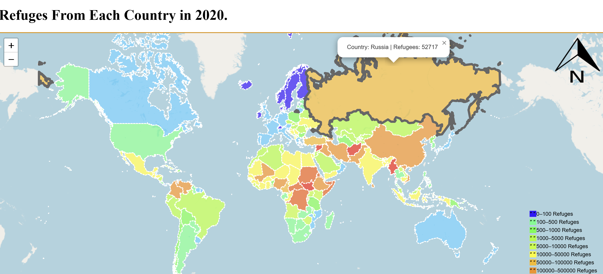

# Refugees From Each Country in 2020

An interactive world map showing the number of refugees from each country in 2020. Created for my geography class.

## Legend

- 0–100 refugees
- 100–500 refugees
- 500–1,000 refugees
- 1,000–5,000 refugees
- 5,000–10,000 refugees
- 10,000–50,000 refugees
- 50,000–100,000 refugees
- 100,000–500,000 refugees

Click a country on the map to view its refugee count.
